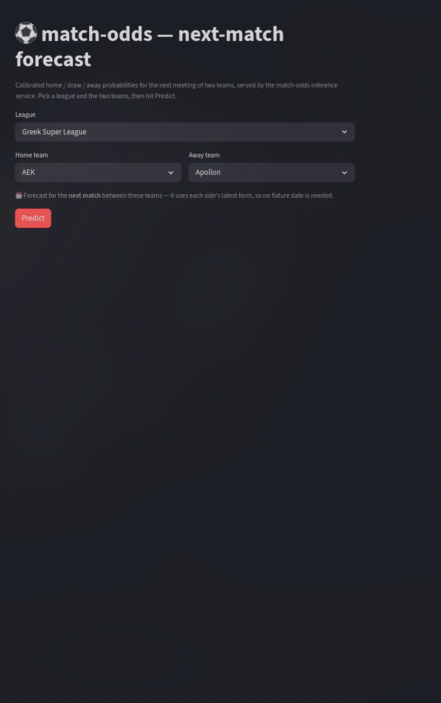

# ⚽ match-odds

> **Python 3.14 · pandas · NumPy · scikit-learn · XGBoost · FastAPI · Streamlit · Docker**
>
> A probabilistic football match-outcome predictor: public historical results → a leakage-free feature pipeline → calibrated XGBoost / logistic-regression models (evaluated on proper scoring rules) → a Dockerised FastAPI inference endpoint, with a small Streamlit demo on top. Calibrated home / draw / away win probabilities for the Greek Super League and the top-5 European leagues.

[](https://github.com/kantarelis/match-odds/actions/workflows/ci.yml)


---

## 🧭 Table of Contents

- [🏗️ Overview](#overview)
- [🎯 What this demonstrates](#what-this-demonstrates)
- [🎬 Demo](#demo)
- [📁 Project Structure](#project-structure)
- [⚙️ Prerequisites](#prerequisites)
- [🚀 Quick Start](#quick-start)
- [📊 Results — current artifact](#results)
- [📚 Documentation](#documentation)
- [🧩 Tech Stack](#tech-stack)
- [🔁 Reproducibility](#reproducibility)
- [🌐 Data sources](#data-sources)
- [🚫 Constraints / out of scope](#constraints)
- [📜 License](#license)


<a id="overview"></a>

## 🏗️ Overview

`match-odds` is a **notebook-to-service** ML repo. Exploratory work lives in `notebooks/`
(`01_data`, `02_modeling`, `03_betting_edge`), but every reusable transform lives in the
importable `matchodds` package under `src/`, so the **same feature code that trains the model
also serves predictions** — no train / serve skew. The model is trained in a notebook, frozen to
`models/v1.joblib`, and loaded by a FastAPI service that reconstructs features at request time.

Deployment is **local-only** via Docker / `make`. The serving image and the Streamlit demo both
run locally, brought up together with `make up`.


<a id="what-this-demonstrates"></a>

## 🎯 What this demonstrates

A single artifact aimed at recruiters scanning for ML / data-engineering signal.

| Role | What you'll find here | Where to look |
| ---- | --------------------- | ------------- |
| **ML Engineer (primary)** | Leakage-free time-ordered CV; bake-off across discriminative (logistic, XGBoost) and the domain-canonical generative model (Dixon-Coles bivariate-Poisson); **hold-out (prefit) calibration** (`sklearn.frozen.FrozenEstimator` + `CalibratedClassifierCV`); evaluation on **proper scoring rules** (log-loss + Brier, accuracy never optimised); deterministic frozen artifact served behind FastAPI with no train/serve skew. | [`src/matchodds/modeling/`](src/matchodds/modeling/), [`docs/evaluation.md`](docs/evaluation.md), [`docs/model_card.md`](docs/model_card.md) |
| **Data Engineer (bonus)** | A small, clean ETL: pinned public CSVs → Pydantic-validated rows → canonical normalized team names → a master matches Parquet → a leakage-free feature Parquet. Per-feature snapshot proofs documented inline. | [`src/matchodds/data/`](src/matchodds/data/), [`src/matchodds/features/`](src/matchodds/features/), [`docs/feature-pipeline.md`](docs/feature-pipeline.md) |
| **Software Engineer** | Typed Python 3.14, strict static-analysis gate (isort, black, flake8, mypy strict, bandit, vulture, nbqa), pytest suite (155 tests), Manager/Views serving pattern, GitHub Actions CI. | [`makefile`](makefile), [`pyproject.toml`](pyproject.toml), [`serving/app/`](serving/app/), [`.github/workflows/ci.yml`](.github/workflows/ci.yml) |


<a id="demo"></a>

## 🎬 Demo

<p align="center">
  
</p>

Pick a league and the two teams, hit Predict — the demo POSTs the fixture to the FastAPI service
(`POST /predict`) and renders the calibrated `home / draw / away` probabilities as a bar chart
plus a one-line plain-English read.


<a id="project-structure"></a>

## 📁 Project Structure

```
match-odds/
│
├── notebooks/              # Narrative work; thin cells importing from matchodds/
│   ├── 01_data.ipynb
│   ├── 02_modeling.ipynb
│   └── 03_betting_edge.ipynb   # Historical / illustrative only
├── src/matchodds/          # The importable package — single source of truth
│   ├── data/               # Acquisition + cleaning (small ETL)
│   ├── features/           # Leakage-free feature pipeline (Elo, form, h2h, strength, season)
│   └── modeling/           # CV, metrics, calibration, baselines, train, betting
├── serving/                # FastAPI inference service (Manager/Views, Dockerized)
├── demo/                   # Streamlit demo — thin HTTP client of the serving container
├── models/                 # Frozen artifact + metadata sidecar (committed)
├── data/                   # GITIGNORED — raw + processed Parquets, reproduced via `make data`
├── docs/                   # Model card, evaluation, architecture, feature pipeline + per-epic history
├── tests/                  # Unit tests + tiny synthetic fixtures
├── .github/workflows/      # CI: make check + make test + nb-lint + nb-run
├── makefile                # Every dev entrypoint
└── pyproject.toml          # Tool configs (black / isort / flake8 / mypy / bandit / vulture / nbqa)
```


<a id="prerequisites"></a>

## ⚙️ Prerequisites

- [Python 3.14](https://www.python.org/downloads/)
- [Docker & Docker Compose](https://docs.docker.com/get-docker/) — for `make up` (serving + demo containers)
- [Make](https://www.gnu.org/software/make/)


<a id="quick-start"></a>

## 🚀 Quick Start

### 1. Install dependencies + the local toolchain

```bash
make install-dev
```

Creates `.venv`, installs the `matchodds` package, the dev deps (Jupyter, linters, matplotlib,
statsmodels, streamlit), and the test deps (pytest, httpx).

### 2. Reproduce the artifact (deterministic)

```bash
make repro
```

Runs the full chain `data → features → train` from a single seed (`settings.random_seed = 42`)
on the pinned data version. Lands `models/v1.joblib` + `models/v1.metadata.json`. Takes ~30 s.

### 3. Run the service + demo

```bash
make up
```

Builds and starts the FastAPI service + the Streamlit demo together via `docker-compose`.

| What | URL |
|------|-----|
| Streamlit demo | http://localhost:8501 |
| FastAPI Swagger | http://localhost:8000/docs |
| FastAPI health | http://localhost:8000/health |

`make down` tears the stack down; `make restart` rebuilds images + restarts. Without Docker,
`make serve` runs the FastAPI app locally (uvicorn, hot reload) and `make demo` runs the
Streamlit demo locally — the demo expects the service on `http://127.0.0.1:8000` by default.

### Working without a full data download

For development against the committed sample fixture (no `make data` required):

```bash
MATCHODDS_DATA_DIR=tests/fixtures/sample make features train
```

`make help` lists every target.


<a id="results"></a>

## 📊 Results — current artifact

Mean five-fold temporal-CV scores from [`models/v1.metadata.json`](models/v1.metadata.json),
current as of `2026-05-28` (re-check by running `cat models/v1.metadata.json` or `make repro`):

| Model         | Log-loss ↓ | Brier ↓  | Accuracy ↑ | Deployable |
|---------------|-----------:|---------:|-----------:|:----------:|
| baseline      |   0.963294 | 0.572118 |   0.538249 |     no     |
| **logistic**  | **0.994531** | **0.593024** | **0.520419** | **yes (selected)** |
| xgboost       |   1.002992 | 0.598731 |   0.513558 |     yes    |
| dixon_coles   |   1.002473 | 0.598192 |   0.506645 |     yes    |

The bookmaker baseline beats every deployable model — the honest result on closing odds, which
already encode the market's probability estimate. Selection minimises CV log-loss on the
**deployable** set; the shipped logistic + sigmoid artifact wins on both proper scoring rules.

Full protocol + the Epic-06.5 calibration story: [`docs/evaluation.md`](docs/evaluation.md).


<a id="documentation"></a>

## 📚 Documentation

Architectural and operational deep-dives live in [`docs/`](docs/):

| Topic | Document |
| ----- | -------- |
| Model card (intended use, data, calibration, limitations, ethics) | [`docs/model_card.md`](docs/model_card.md) |
| Architecture (Mermaid data flow + the three load-bearing invariants) | [`docs/architecture.md`](docs/architecture.md) |
| Evaluation (CV protocol, metric tables, calibration, reproducibility) | [`docs/evaluation.md`](docs/evaluation.md) |
| Feature pipeline (per-feature leakage proof) | [`docs/feature-pipeline.md`](docs/feature-pipeline.md) |
| Per-epic plans + outcome records | [`docs/history/`](docs/history/) |

Repo conventions and the development workflow are documented in [`CLAUDE.md`](CLAUDE.md); the
epic-level roadmap lives in [`MASTER_PLAN.md`](MASTER_PLAN.md).


<a id="tech-stack"></a>

## 🧩 Tech Stack

* **Language**: Python 3.14
* **Modeling**: pandas, NumPy, scikit-learn, XGBoost, scipy (Dixon-Coles MLE)
* **Validation & config**: Pydantic v2 + pydantic-settings
* **Notebooks**: Jupyter, executed headless in CI via papermill, linted via nbqa
* **Serving**: FastAPI + Uvicorn, artifact loaded with joblib (Manager/Views pattern)
* **Demo**: Streamlit + Altair
* **Packaging / Ops**: Makefile, Docker + docker-compose (local-only)
* **CI**: GitHub Actions — `make check` + `make test` + `make nb-lint` + `make nb-run`
* **Static analysis**: isort, black, flake8, mypy (strict), bandit, vulture, nbqa


<a id="reproducibility"></a>

## 🔁 Reproducibility

`make repro` is the full chain `data → features → train` and is **deterministic** from
`settings.random_seed = 42` on the pinned data version. Two consecutive `make train` runs
produce identical CV scores; a fresh-clone

```bash
git clone https://github.com/kantarelis/match-odds && cd match-odds
make install-dev && make repro && make up
```

reproduces the metric scores recorded in [`models/v1.metadata.json`](models/v1.metadata.json)
exactly (the **scores**, not the pickled bytes — pickle format depends on joblib /
scikit-learn versions). The `data_version` and `library_versions` fields in the metadata pin the
inputs.


<a id="data-sources"></a>

## 🌐 Data sources

Public, no scraping, no live feeds, no authenticated APIs.

| Source | Used for | Files |
| ------ | -------- | ----- |
| [football-data.co.uk](https://www.football-data.co.uk/) — `mmz4281/{season}/{div}.csv` | Full-time results + closing odds; the **only** data source | Pinned URLs in [`matchodds.data.sources`](src/matchodds/data/sources.py); per-snapshot manifest at `data/raw/_manifest.json` |

Leagues in scope (six): English Premier League · Spanish La Liga · Italian Serie A · French
Ligue 1 · German Bundesliga · Greek Super League. The set lives in
[`src/matchodds/config.py`](src/matchodds/config.py).


<a id="constraints"></a>

## 🚫 Constraints / out of scope

- **No live betting, no real-money use, no advice.** This repo carries no live-odds ingestion,
  no bet-placement code, and no real-money framing anywhere. The output is calibrated
  probabilities for a portfolio demo, not a recommendation to act on.
- **The betting-edge notebook is historical and illustrative only.**
  [`notebooks/03_betting_edge.ipynb`](notebooks/03_betting_edge.ipynb) measures the model against
  past closing odds; on the current artifact its ROI is *negative* at every threshold tested —
  honestly reflecting that closing odds are an efficient benchmark and this model targets
  honest probabilities, not betting profit.
- **No scraping, no live odds, no authenticated APIs.** Only the bulk CSVs above.
- **No cloud hosting in this repo.** Local-only via Docker / `make`.
- **Six leagues, ten seasons.** Out-of-distribution leagues (women's football, lower divisions,
  cup competitions, friendlies) are deliberately out of scope.


<a id="license"></a>

## 📜 License

MIT — see [LICENSE](LICENSE). Research and demonstration only; see *Constraints* above for the
explicit no-real-money framing.
