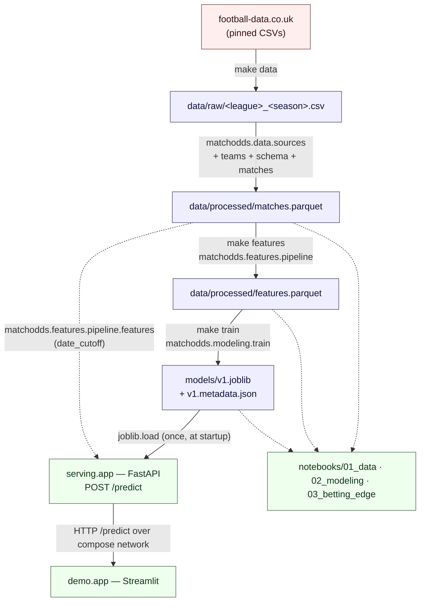

# Architecture

How `match-odds` flows from public CSVs to a calibrated 1X2 forecast in the demo — one diagram, a
layer map so every box points to real code, and the three load-bearing invariants the whole repo
enforces.

## Data flow

> The **solid** arrows are the build chain `make data → make features → make train → make up`.
> The **dotted** arrow from `matches.parquet` into the serving box is the deliberate train-serve
> equivalence: serving re-runs the *same* `matchodds.features.pipeline.features(date_cutoff)`
> against the master matches table at every request — never a separate feature implementation.
> Notebooks are read-only consumers of the build chain's outputs and never live in the request path.

## Layers — every box → real code

| Diagram box | Module / path | Role |
|---|---|---|
| `football-data.co.uk` | external — pinned URLs in [`matchodds.data.sources`](../src/matchodds/data/sources.py) | One CSV per league-season; the only data source. |
| `data/raw/…csv` | [`data/`](../data/) (gitignored) | Cached downloads + a `raw/_manifest.json` provenance file. |
| `matches.parquet` | written by [`matchodds.data.matches`](../src/matchodds/data/matches.py) | Cleaned + de-duplicated master table; teams normalised via [`matchodds.data.teams`](../src/matchodds/data/teams.py); each row validated by the Pydantic [`Match`](../src/matchodds/data/schema.py) model at the ingestion edge. |
| `features.parquet` | written by [`matchodds.features.pipeline.build`](../src/matchodds/features/pipeline.py) | Leakage-free feature table; per-feature snapshot logic in [`features/elo.py`](../src/matchodds/features/elo.py), [`form.py`](../src/matchodds/features/form.py), [`head_to_head.py`](../src/matchodds/features/head_to_head.py), [`strength.py`](../src/matchodds/features/strength.py), [`season.py`](../src/matchodds/features/season.py); contract documented in [`docs/feature-pipeline.md`](feature-pipeline.md). |
| `v1.joblib + metadata` | written by [`matchodds.modeling.train`](../src/matchodds/modeling/train.py) | The bake-off (baseline vs [`logistic`](../src/matchodds/modeling/logistic.py) vs [`xgboost_model`](../src/matchodds/modeling/xgboost_model.py) vs [`dixon_coles`](../src/matchodds/modeling/dixon_coles.py)), [time-ordered CV](../src/matchodds/modeling/cv.py), proper-scoring [metrics](../src/matchodds/modeling/metrics.py), [hold-out calibration](../src/matchodds/modeling/calibration.py), winning artifact + metadata sidecar (per-model CV scores, seed, library versions, data version). |
| `serving.app` | [`serving/app/main.py`](../serving/app/main.py) (app factory) + [`api/main`](../serving/app/api/main/) (health / env / metrics) + [`api/predict`](../serving/app/api/predict/) (Manager + Views); [`inference.py`](../serving/app/inference.py) loads the artifact once and rebuilds the single feature row via `matchodds.features.pipeline.features(...)`; HTTP contract in [`schemas.py`](../serving/app/schemas.py). | Read-only FastAPI service. |
| `demo.app` | [`demo/app.py`](../demo/app.py) (Streamlit UI) + [`demo/service.py`](../demo/service.py) (HTTP client) + [`demo/summary.py`](../demo/summary.py) (plain-English read). | Data-free, model-free client of the serving container. |
| `notebooks/…` | [`notebooks/01_data.ipynb`](../notebooks/01_data.ipynb), [`02_modeling.ipynb`](../notebooks/02_modeling.ipynb), [`03_betting_edge.ipynb`](../notebooks/03_betting_edge.ipynb) | Thin narratives — every cell imports from `matchodds`. Linted by `nbqa`, smoke-executed by `make nb-run` in CI. |

## Invariants

Three rules the whole repo is built around; every PR has to respect them.

### 1. No leakage

A feature for a match may depend **only on matches played on strictly earlier dates**, and a model
fold may train only on matches dated strictly before its test rows. Enforced at three layers:

- [`matchodds.features.pipeline.features(date_cutoff)`](../src/matchodds/features/pipeline.py) — the
  single point-in-time entrypoint. Each accumulator's `pre_match(…)` is called *before* `update(…)`
  is called with the played match, so a snapshot can never see its own match's result. Per-feature
  proof in [`docs/feature-pipeline.md`](feature-pipeline.md).
- [`matchodds.modeling.cv.TimeOrderedSplit`](../src/matchodds/modeling/cv.py) — forward-chained
  temporal CV; a single calendar day is never split across the train / test boundary. Plain
  `KFold` / `StratifiedKFold` is **never** used on match data (`CLAUDE.md` → *ML / Modeling
  Discipline*).
- [`matchodds.modeling.calibration`](../src/matchodds/modeling/calibration.py) — the Epic 06.5
  hold-out (prefit) scheme: the base estimator fits on the final fold's expanding-window training
  slice, then `FrozenEstimator` + `CalibratedClassifierCV` fits the calibration regressor on the
  strictly-later held-out tail. Calibrator data is always dated after the base's training window.

### 2. No train-serve skew

The **same** feature-pipeline code runs at training time and at inference time — no parallel
implementation, no "service-friendly subset". Enforced two ways:

- [`serving.app.inference.Inference.predict`](../serving/app/inference.py) calls
  `matchodds.features.pipeline.features(self._matches, fixtures, date_cutoff=request.match_date)`
  for every request. This is the same `features(...)` entrypoint
  [`matchodds.modeling.train`](../src/matchodds/modeling/train.py) consumes (via
  `pipeline.build(...)`) when generating the feature table.
- [`Inference._guard_no_skew`](../serving/app/inference.py) — at startup, compares the live
  pipeline's feature column list against the columns recorded in `models/v1.metadata.json`. A
  mismatch raises `RuntimeError` immediately rather than silently scoring the wrong columns.

### 3. Determinism

`make repro` (the full chain `data → features → train`) reproduces the metric scores recorded in
`models/v1.metadata.json` exactly, from any fresh clone, on the pinned data version. The
construction:

- A single `settings.random_seed` (default 42) flows into every split, estimator, and calibrator
  (`config.py` → `random_seed`; consumed in `LogisticModel`, `XGBoostModel`, `TimeOrderedSplit`,
  `calibration.calibrate`).
- XGBoost runs single-threaded (`n_jobs=1`) so its tree-build reduction order is fixed.
- Two consecutive `make train` runs produce **identical** metrics across every candidate model and
  every metric — verified at Epic 06.5 Task 2 close-out.

> Note: `make repro` reproduces the **metric scores** in the metadata sidecar, not necessarily the
> pickled bytes of `models/v1.joblib` (which can vary across joblib / scikit-learn pickle-format
> revisions). The honest contract is on the numbers the metadata records.

## Where this comes from

- The per-epic decision trail lives under [`docs/history/`](history/) — each archived `PLAN.md` is
  the audit record of why a particular layer looks the way it does.
- The model card sits at [`docs/model_card.md`](model_card.md); the evaluation deep-dive at
  [`docs/evaluation.md`](evaluation.md); the per-feature contract at
  [`docs/feature-pipeline.md`](feature-pipeline.md).
